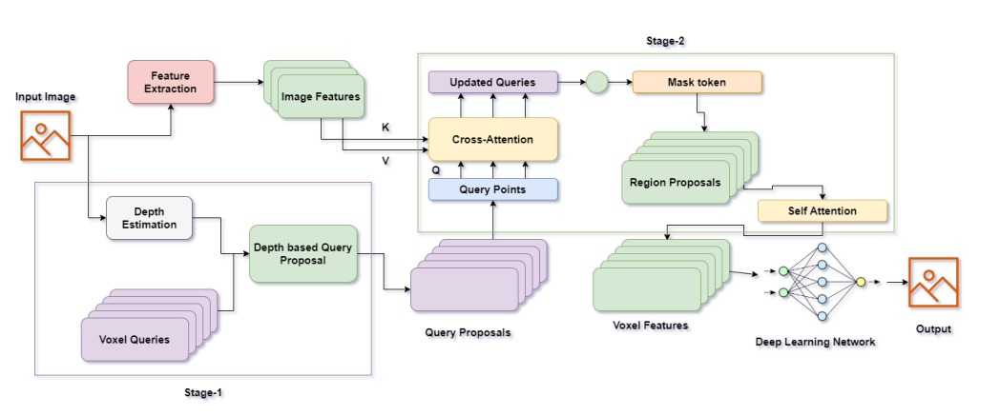

   
  
# 3D Semantic Explorer: Deep Learning for Complex Semantic Labeling and Occupancy Prediction

> [Nishanth Ravula, Syfullah Mohammad, Uday Tej Togiti]

>  [[Report]](https://arxiv.org/pdf/2302.12251.pdf)

 

## Abstract
Humans have the ability to formulate a 3D mental map of the entire surrounding present around them. While this ability to form a semantic understanding of the environment might be taken for granted, it is in practice a challenging task as it required extraction and processing of multiple scene information. While existing solution making use of 3D Simultaneous Localization and Mapping (SLAM) propose reliable robotics-based solutions to the above problem, incorporating recent advancements in the field of AI (visual transformers) might provide the versatile solutions researchers have been looking for. Towards this we propose 3D Semantic Explorer, a transformer based 3D mapping model that analyzes, extract semantic information from various view points, and performs complex semantic labelling and occupancy prediction given an environment. To achieve this we use voxels to develop 3D semantic scene completion followed by using CNNs to predict occupancy of semantic labels for each voxel in 3D space. By proper consideration of Sparsity and class imbalance, the proposed model performs significantly well on the semantic kitty dataset.

## Method

|  | 
|:--:| 
| ***Figure 1. Proposed architecture **. The pipeline starts with an input image. The first step is feature extraction, which extracts important patterns and characteristics from the input image. Then, the pipeline estimates the depth of the image and generates voxel queries based on the estimated depth. The voxel queries and depth information are used to form a depth-based query proposal, which suggests areas in the image that the deep learning network should focus on. The query proposal is then updated using cross attention, and the queries are refined further using mask and region proposals. The mask represents the most relevant regions in the image, and region proposals are generated from the mask. The updated queries and region proposals are then refined further using self-attention. Finally, the region proposals and voxel features are combined to form a deep learning network, which generates an output based on the image features and the query proposal. The goal of the pipeline is to extract the most important features from the input image and generate an accurate and useful output from the deep learning network by focusing its attention on the most relevant parts of the image.* |

## Getting Started
- [Installation](instruction_files/install.md) 
- [Prepare Dataset](instruction_files/prepare_dataset.md)
- [Run and Eval](instruction_files/getting_started.md)

## Dataset

- [x] SemanticKITTI

## License
Copyright © 2022-2023, NVIDIA Corporation and Affiliates. All rights reserved.

This work is made available under the Nvidia Source Code License-NC. Click [here](https://github.com/NVlabs/semanticEx/blob/main/LICENSE) to view a copy of this license.

The pre-trained models are shared under [CC-BY-NC-SA-4.0](https://creativecommons.org/licenses/by-nc-sa/4.0/). If you remix, transform, or build upon the material, you must distribute your contributions under the same license as the original.

For business inquiries, please visit our website and submit the form: [NVIDIA Research Licensing](https://www.nvidia.com/en-us/research/inquiries/).
