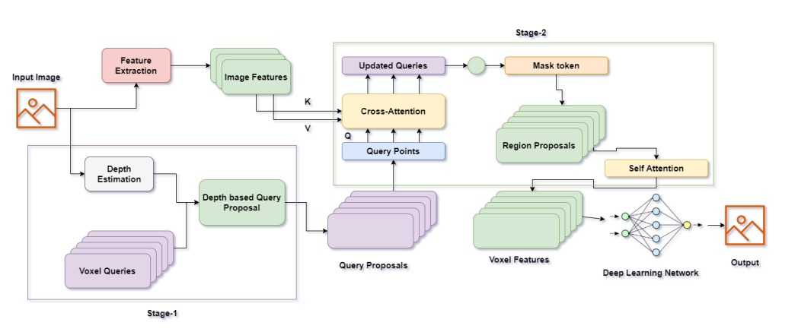

   
  
# 3D Semantic Explorer: Deep Learning for Complex Semantic Labeling and Occupancy Prediction

> [Nishanth Ravula, Syfullah Mohammad, Uday Tej Togiti]

>  [[Report]](https://arxiv.org/pdf/2302.12251.pdf)

 

## Abstract
Humans have the ability to formulate a 3D mental map of the entire surrounding present around them. While this ability to form a semantic understanding of the environment might be taken for granted, it is in practice a challenging task as it required extraction and processing of multiple scene information. While existing solution making use of 3D Simultaneous Localization and Mapping (SLAM) propose reliable robotics-based solutions to the above problem, incorporating recent advancements in the field of AI (visual transformers) might provide the versatile solutions researchers have been looking for. Towards this we propose 3D Semantic Explorer, a transformer based 3D mapping model that analyzes, extract semantic information from various view points, and performs complex semantic labelling and occupancy prediction given an environment. To achieve this we use voxels to develop 3D semantic scene completion followed by using CNNs to predict occupancy of semantic labels for each voxel in 3D space. By proper consideration of Sparsity and class imbalance, the proposed model performs significantly well on the semantic kitty dataset.

## Method

|  | 
|:--:| 
| ***Figure 1. Proposed architecture **. Given RGB images, 2D features are extracted by ResNet50 and the depth is estimated by an off-the-shelf depth predictor. The estimated depth after correction enables the class-agnostic query proposal stage: the query located at an occupied position will be selected to carry out deformable cross-attention with image features. Afterwards, mask tokens will be added for completing voxel features by deformable self-attention. The refined voxel features will be upsampled and projected to the output space for per-voxel semantic segmentation. Note that our framework supports the input of single or multiple images.* |

## Getting Started
- [Installation](docs/install.md) 
- [Prepare Dataset](docs/prepare_dataset.md)
- [Run and Eval](docs/getting_started.md)

## Dataset

- [x] SemanticKITTI

## License
Copyright © 2022-2023, NVIDIA Corporation and Affiliates. All rights reserved.

This work is made available under the Nvidia Source Code License-NC. Click [here](https://github.com/NVlabs/VoxFormer/blob/main/LICENSE) to view a copy of this license.

The pre-trained models are shared under [CC-BY-NC-SA-4.0](https://creativecommons.org/licenses/by-nc-sa/4.0/). If you remix, transform, or build upon the material, you must distribute your contributions under the same license as the original.

For business inquiries, please visit our website and submit the form: [NVIDIA Research Licensing](https://www.nvidia.com/en-us/research/inquiries/).

## Acknowledgement

Many thanks to these excellent open source projects:
- [BEVFormer](https://github.com/fundamentalvision/BEVFormer)
- [mmdet3d](https://github.com/open-mmlab/mmdetection3d)
- [MonoScene](https://github.com/astra-vision/MonoScene)
- [LMSCNet](https://github.com/astra-vision/LMSCNet)
- [semantic-kitti-api](https://github.com/PRBonn/semantic-kitti-api) 
- [MobileStereoNet](https://github.com/cogsys-tuebingen/mobilestereonet)
- [Pseudo_Lidar_V2](https://github.com/mileyan/Pseudo_Lidar_V2)
- [wysiwyg](https://github.com/peiyunh/wysiwyg)
